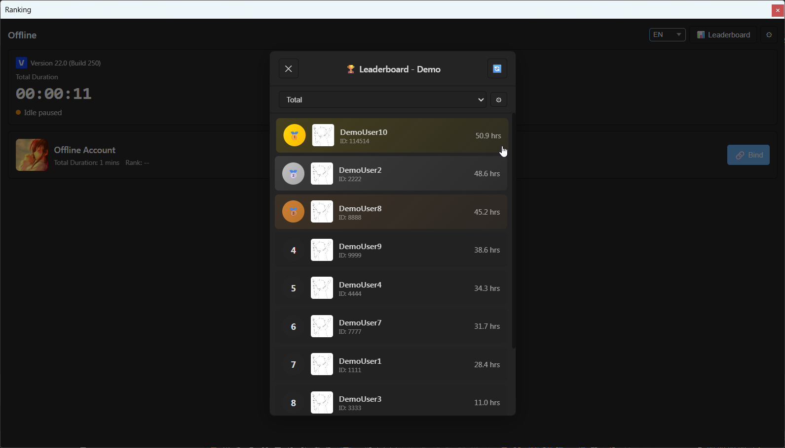

# RankingVegas_Template

[English](./README.md) | [中文](./README.zh.md) | [日本語](./README.ja.md)

VEGAS Pro 拡張を作るためのテンプレートプロジェクトです。ランキング、タイムトラッキング、AFK 検出を提供し、オンライン/オフライン モードおよび 2 つの UI スタイル（WebView2 ベースと WinForms フォールバック）をサポートします。

## 主な機能



- ランキング機能（オンラインのみ）。オフラインモードではタイムトラッキングのみ利用可能です。
- タイムトラッキングと自動アクティビティ/AFK 検出
- ランキングのグループ管理（独立したランキンググループの管理が可能）
- 多言語対応：英語、中国語（簡体）、日本語
- 2 種類の UI: WebView2 ベースのモダン UI と WinForms フォールバック
- リモートランキング API と接続するための設定可能なアプリプロファイル
- ILRepack を使った単一 DLL へのパッケージ化（VEGAS Pro 拡張フォルダへの配置オプションあり）

## ビルドと開発

- 推奨 IDE: Visual Studio 2022 / 2026
- サポートされている VEGAS Pro バージョン: MAGIX VEGAS Pro 14+ / Sony VEGAS Pro 13
- パッケージ管理: NuGet
- ターゲットフレームワーク: .NET Framework 4.8

### VEGAS Pro SDK リファレンス

プロジェクトは VEGAS Pro スクリプト API に依存します。次のいずれかの DLL を参照に追加してください：

- MAGIX VEGAS Pro 14 以降:
  - `ScriptPortal.Vegas.dll`
  - `ScriptPortal.MediaSoftware.Skins.dll`

- Sony VEGAS Pro 13:
  - `Sony.Vegas.dll`
  - `Sony.MediaSoftware.Skins.dll`

Sony 版をターゲットにする場合、プロジェクト設定の「条件付きコンパイルシンボル」に `Sony` を追加してください。

### App プロファイル設定

`RankingAppProfile.Local.template.cs` を `RankingAppProfile.Local.cs` にリネームして、API キーやエンドポイントなどを記入してください。本プロジェクトはアカウント管理とオンラインランキングを提供するサーバー側の実装を必要とします。参考となる API は以下（中国語ページ）です：

https://otm.ink/article/api-ranking

参照 API と実装が異なる場合は、`RankingApiClient` のロジックを調整する必要があります。

### オフラインデモの簡易ビルド

手早くオフラインのデモ版をビルドしたい場合は、プロジェクト設定（ビルド → 条件付きコンパイルシンボル）に `DEMO` を追加してください。これによりテンプレートの AppProfile が有効になり、サーバーに接続できない場合は接続エラーを無視してデモデータでランキングを埋めるデモモードでビルドされます。

### Assembly 情報

`Properties/AssemblyInfo.cs` を編集してアセンブリの製品名、会社名、バージョン情報を設定してください。

### ビルド後パッケージング

ILRepack を用いて依存ライブラリを単一 DLL にまとめるためのビルド後イベントが設定されています。コマンドは次の通りです：

```
"$(SolutionDir)packages\ILRepack.2.0.44\tools\ILRepack.exe" /out:"$(TargetDir)Merged\$(TargetFileName)" "$(TargetPath)" "$(TargetDir)Newtonsoft.Json.dll" "$(TargetDir)Microsoft.Web.WebView2.Core.dll" "$(TargetDir)Microsoft.Web.WebView2.WinForms.dll" "$(TargetDir)System.Buffers.dll" "$(TargetDir)System.Memory.dll" "$(TargetDir)System.Numerics.Vectors.dll" "$(TargetDir)System.Runtime.CompilerServices.Unsafe.dll" "$(TargetDir)System.Text.Encoding.CodePages.dll" "$(TargetDir)SixLabors.ImageSharp.dll"
:: xcopy /R /Y "$(TargetDir)Merged\$(TargetFileName)" "C:\ProgramData\VEGAS Pro\Application Extensions\"
```

このコマンドは `$(TargetDir)Merged` に統合されたアセンブリを生成します。コメントアウトされた `xcopy` 行を有効にすれば、出力 DLL を VEGAS Pro の拡張フォルダにコピーできます。

追加メモ — 一般的な VEGAS Pro 拡張ディレクトリ

生成した DLL は、一般的には以下のいずれかの VEGAS Pro 拡張フォルダにインストールできます（`22.0` は対象の VEGAS バージョンに置き換えてください）:

```
C:\ProgramData\VEGAS Pro\Application Extensions\
C:\ProgramData\VEGAS Pro\22.0\Application Extensions\
%userprofile%\Documents\Vegas Application Extensions\
%appdata%\VEGAS Pro\Application Extensions\
%appdata%\VEGAS Pro\22.0\Application Extensions\
%localappdata%\VEGAS Pro\Application Extensions\
%localappdata%\VEGAS Pro\22.0\Application Extensions\
```

Sony 版（VP13 以下）の場合、パスは親の `Sony` フォルダー内になることがあります。例：

```
C:\ProgramData\Sony\VEGAS Pro\Application Extensions\
```

ターゲットマシンにインストールされている VEGAS Pro のバージョンに合ったフォルダーを選択してください。

インストール後、VEGAS Pro のメニューバーから `View` → `Extensions` → `RankingVegas` を選択して本拡張を開くことができます。

### セキュリティ / 難読化

.NET アセンブリは逆コンパイルされやすいため、API キーやシークレットなどの機密情報をバイナリに埋め込まないでください。難読化ツールの使用やサーバー側でのトークン交換を検討してください。

## ライセンス

本プロジェクトは MIT ライセンスの下で公開されています。詳細は `LICENSE` を参照してください。

## サードパーティ依存とライセンス

- `Newtonsoft.Json` — MIT（Json.NET）
- `Microsoft.Web.WebView2`（Core & WinForms） — MIT（Microsoft）
- `SixLabors.ImageSharp` — Apache-2.0
- `ILRepack` — MIT
- VEGAS SDK DLLs（`ScriptPortal.Vegas.dll`、`ScriptPortal.MediaSoftware.Skins.dll`、`Sony.Vegas.dll`、`Sony.MediaSoftware.Skins.dll`）— MAGIX / Sony 提供のプロプライエタリコンポーネント。VEGAS Pro SDK のライセンスと配布規約に従ってください。

他の NuGet パッケージを含める場合は、それぞれのライセンスを確認してください。

## 備考

- このテンプレートはオンライン機能をサポートするサーバー実装が存在することを前提としています。オフラインのみでの利用も可能ですが、ランキングやオンライン同期などの機能は利用できません。
- WebView2 UI は WebView2 ランタイムを必要とします。WebView2 が利用できない場合は WinForms UI にフォールバックします。

### Microsoft Edge WebView2 ランタイム

WebView2 ベースのモダンな UI を使用するには、ターゲット環境に Microsoft Edge WebView2 ランタイムをインストールする必要があります（プロジェクトで使用している `Microsoft.Web.WebView2` NuGet パッケージとは別物です）。以下の公式ページから適切なインストーラーを入手してください：

https://developer.microsoft.com/microsoft-edge/webview2/

補足：最近の一部の Windows 10 ビルドおよび Windows 11 では、Edge WebView2 ランタイムが OS に組み込まれているため、手動でインストールする必要がない場合があります。

ターゲット環境に WebView2 ランタイムがない場合、本拡張は自動的に WinForms UI にフォールバックします。WebView2 がなくてもプロジェクトは利用可能です。

---

テンプレートを編集して、あなたの VEGAS Pro 拡張開発にお役立てください。